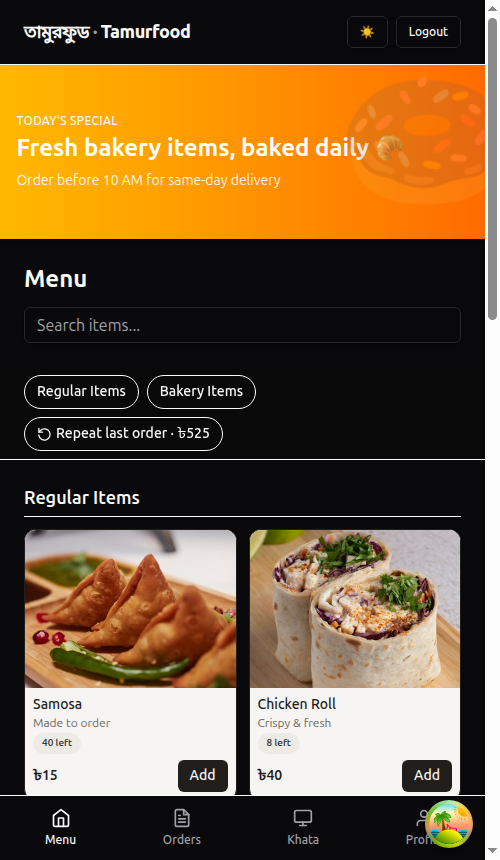
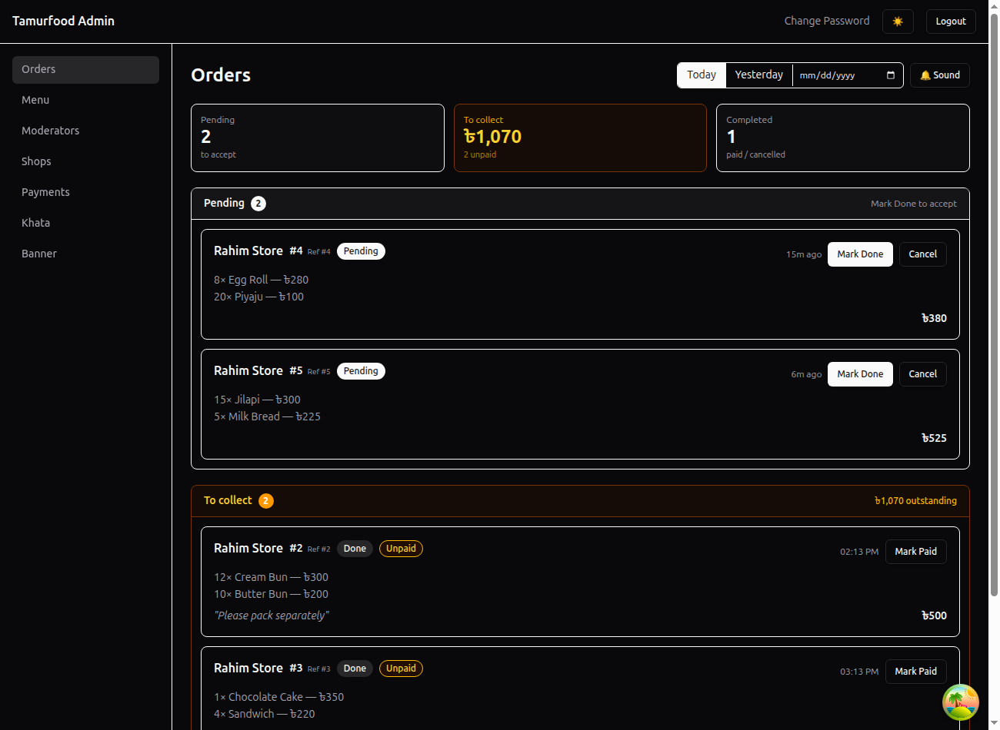
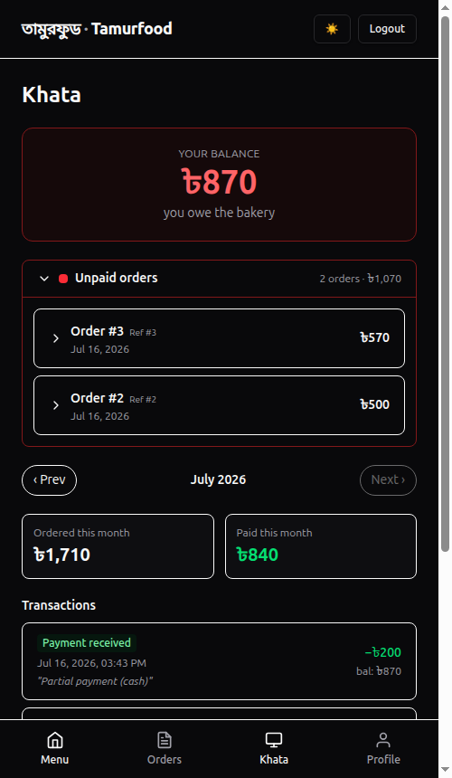
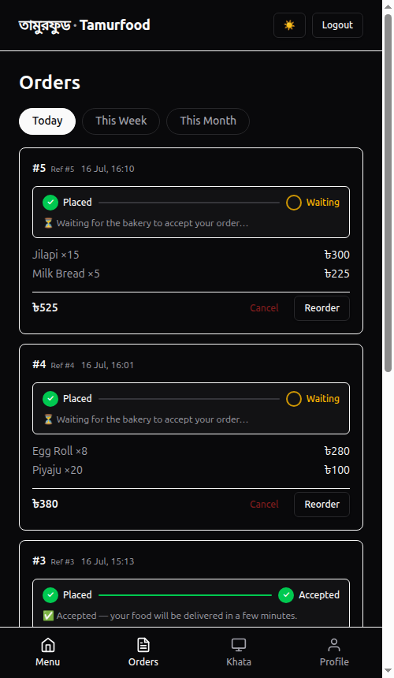
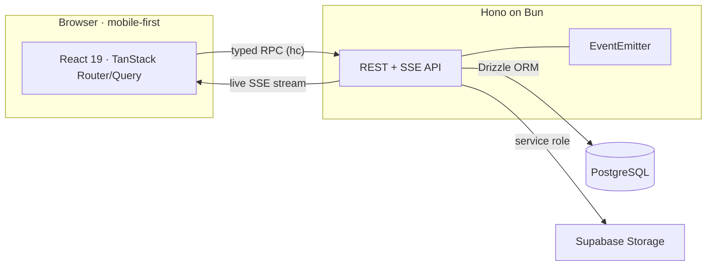

# 🥐 Tamurfood

**A real-time, B2B wholesale ordering platform for a bakery** — shops place orders from a live menu, staff fulfil them in real time, and a built-in ledger ("Khata") tracks exactly what every shop owes.

Built and deployed as a production application handling real orders and payments.

> Full-stack TypeScript · React 19 · Hono · PostgreSQL · Real-time SSE · Role-based access

## Screenshots

<!-- Add images to docs/screenshots/ (see the guide there). They render once present. -->

| Shop — live menu                             | Admin — live orders                                      |
| -------------------------------------------- | -------------------------------------------------------- |
|  |  |

| Khata ledger                         | Live order tracker                                   |
| ------------------------------------ | ---------------------------------------------------- |
|  |  |

---

## What it is

Tamurfood is the ordering and accounts system for a wholesale bakery. Retail shops log in, order baked goods from a live catalogue, and track their dues. Bakery staff see orders arrive in real time, fulfil them, and manage stock, menu, and payments. Every order and payment flows into a per-shop ledger so the bakery always knows who owes what.

It's a complete, production-grade system — not a demo — covering authentication, real-time updates, concurrency-safe inventory, a money model, and role-based workflows.

## Highlights

- ⚡ **Real-time everywhere (SSE)** — new orders appear on the staff dashboard instantly; shops watch their order status flip to _Accepted_ live, with notification badges and "NEW" markers.
- 💰 **Money model / Khata ledger** — per-shop running balance (`orders − payments`), partial payments, payments linked to the orders they settle, and a collections-by-staff reconciliation view.
- 📦 **Concurrency-safe stock** — tracked items are decremented atomically inside a transaction, so concurrent orders can never oversell the last units.
- 🔢 **Daily order numbers** — a friendly per-day counter (resets at Bangladesh midnight) that never collides, alongside a permanent reference number.
- 👥 **Three roles** — **admin** (full control), **moderator** (operations + menu changes via an approval queue), and **shop** (order + view own ledger).
- 🔒 **Security-hardened** — env validation, rate limiting, Row-Level Security on every table, server-side image upload proxy, hashed passwords.
- 📱 **Mobile-first** — the shop side is designed as a phone app (bottom nav, safe-area aware, refresh-tolerant cart).

## Key features

**Shop (customer) side**

- Live menu with photos, categories, search, and real-time stock/availability
- Cart that survives page refreshes, one-tap re-order of the last order
- Live order tracker (Placed → Accepted) with instant SSE updates
- Own Khata: balance, unpaid orders (with line items), and full transaction history

**Bakery (admin / staff) side**

- Live orders dashboard with sound alerts and one-tap accept / cancel
- Menu & category management, draft/publish, stock control, image uploads
- Payments & Khata: record full or partial payments, mark orders paid, per-shop ledgers
- Analytics: today / week / month order counts & revenue, top shops, custom ranges
- Moderator approval workflow for menu changes

## Roles & permissions

Access is enforced server-side by role, with a lightweight approval workflow for moderators.

| Capability                           | Shop |     Moderator     | Admin |
| ------------------------------------ | :--: | :---------------: | :---: |
| Place orders · view own Khata        |  ✅  |         —         |   —   |
| View & fulfil orders (accept/cancel) |  —   |        ✅         |  ✅   |
| Toggle stock / availability          |  —   |        ✅         |  ✅   |
| Add / edit / delete menu items       |  —   | ⚠️ needs approval |  ✅   |
| Analytics dashboard                  |  —   |        ✅         |  ✅   |
| Manage shops, payments & Khata       |  —   |         —         |  ✅   |
| Approve moderator change requests    |  —   |         —         |  ✅   |

> ⚠️ Moderators **propose** menu changes; they queue for an admin to approve before going live.

## Architecture



## Tech stack

| Layer         | Technology                                                                               |
| ------------- | ---------------------------------------------------------------------------------------- |
| **Frontend**  | React 19, Vite, TanStack Router (file-based), TanStack Query, Tailwind CSS v4, shadcn/ui |
| **Backend**   | Hono on Bun, typed end-to-end RPC (`hc` client + `AppType`)                              |
| **Database**  | PostgreSQL, Drizzle ORM, Row-Level Security                                              |
| **Auth**      | Better Auth (phone + password, role-based sessions)                                      |
| **Real-time** | Server-Sent Events (per-shop + admin streams)                                            |
| **Infra**     | Supabase (Postgres + Storage), Railway (Docker), monorepo via Bun workspaces             |

## Architecture highlights

A few pieces I'm particularly happy with:

- **End-to-end type safety** — the Hono server exports its `AppType`; the frontend calls it through a typed RPC client, so API changes surface as compile errors, not runtime bugs.
- **Atomic inventory** — the order transaction does a conditional `UPDATE ... WHERE stock_quantity >= qty RETURNING`, so the database itself is the source of truth for the last units under concurrent load.
- **Truthful money model** — balance is _derived_ from accepted orders minus payments (never a mutable "balance" column that can drift); payments carry a nullable FK to the order they settled.
- **Real-time without a heavy stack** — a small `EventEmitter` fans out order/payment events to SSE streams, scoped per shop, with a polling fallback if the stream drops.

## Project structure

```
tamurfood/
├── apps/
│   ├── web/        # React 19 + Vite frontend (TanStack Router)
│   └── server/     # Hono API on Bun (typed RPC)
└── packages/
    └── db/         # Drizzle schema + migrations
```

## Getting started

Prerequisites: [Bun](https://bun.sh), [Supabase CLI](https://supabase.com/docs/guides/cli) (Docker).

```bash
# 1. Install dependencies
bun install

# 2. Start local Postgres (Supabase)
supabase start

# 3. Set up env (see .env.example) and run migrations
cp .env.example .env
bun run --cwd packages/db migrate
bun run packages/db/src/seed.ts   # seeds an admin user + sample menu

# 4. Start everything (web :5173, api :3000)
bun dev
```

## Deployment

Deployed on **Railway** via Docker: the frontend is built with Vite and served as static files by the Hono server, which also runs database migrations on boot. Postgres and object storage are hosted on **Supabase**.

## License

© Tamurfood. All rights reserved. This repository is published for portfolio and demonstration purposes; it is not licensed for reuse.
